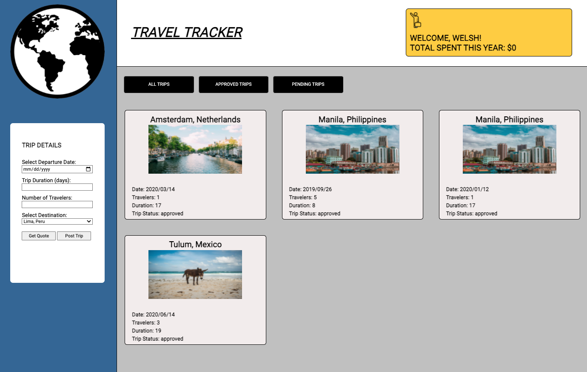

# Travel Tracker!
Travel Tracker! is an application that allows users to view their trips.  Upon logging in to the webpage, a user will be able to view their prior trips and future trips.  Trips can be filtered down to pending trips and approved trips if they choose to do so.  In addition to viewing existing trip information, a user has the option to post a new trip or receive a price quote based on the trip information entered by the user.

## How to Use the App:

- Clone down this repo to your computer
- Access the root folder in your Terminal
- Type `npm install` to install all required dependencies
- Type `npm start` to start local server  
- Paste `http://localhost:8080/` into your web browser to view the application

After the above steps have been followed, please do the following in order to access the data from a local server:

- Clone [this](https://frontend.turing.edu/projects/Fitlit-part-two.html) repo 
- Access the root folder in your Terminal
- Type `npm install` to install all required dependencies
- Type `npm start` to start local server  

## Screenshot:

## Preview:

## Primary Technologies Used:

- Javascript
- HTML
- CSS
- Mocha
- Chai
- Webpack
- Fetch API
- SASS
- Lighthouse Accessibility Audit

## Original Assignment:

- [Travel-tracker](https://frontend.turing.edu/projects/travel-tracker.html) 

## Contributors:

- [Adam Burgess](https://github.com/aburg15)

## Wins:
- Able to implement Fetch API functionality and successfully import and post data from API based on user input
- Followed Test-driven development principles
- Achieved accessibility goals

## Future Iterations:
- Use an NPM package (Micromodal, GlideJS, DayJS, etc.)
- User dashboard will display a countdown to next trip
- Add travel agent feature